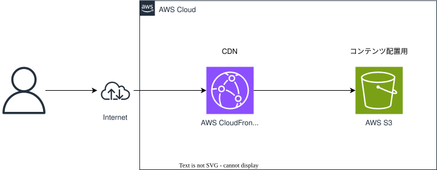

# aws-cloudformation-cdn-001

## 概要

これはAWSを利用したCDN構成のAWS CloudFormationテンプレートです。

## アーキテクチャ図

本構成のアーキテクチャ図を下記に記します。

## 構築AWSアーキテクチャ

| 番号  | サービスタイプ                    | 用途                     |
|-------|----------------------------------|--------------------------|
| 1     | Route53::HostedZone             | DNS                     |
| 2     | CertificateManager::Certificate | パブリック証明書         |
| 3     | S3::Bucket                      | オブジェクトストレージ   |
| 4     | CloudFront::OriginAccessControl | CloudFrontへのアクセス制御 |
| 5     | CloudFront::Distribution        | コンテンツ配信           |
| 6     | S3::BucketPolicy                | S3バケットのポリシー     |
| 7     | Route53::RecordSet              | DNSレコード             |
